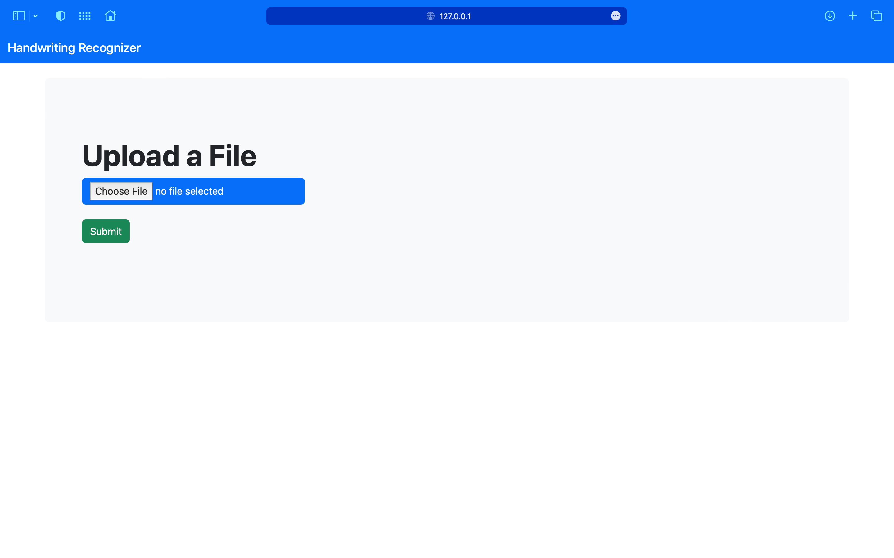

# Handwriting Recognizer

This is a python application which uses flask server to perform handwriting recognition and spelling check for the given input

This project uses the Handwritten Text Recognition (HTR) system implemented with TensorFlow (TF) and trained on the IAM off-line HTR dataset.
The model takes **images of single words or text lines (multiple words) as input** and **outputs the recognized text**.
3/4 of the words from the validation-set are correctly recognized, and the character error rate is around 10%


## Demo and Setup

* Create a virtual environment using the command
```
python -m venv <name_of_env>
```
* After creating the virtual environment add the folder name to `.gitignore` file

* Activate the virtual environment using the command

For MacOS and Linux based systems
```
source path/to/env/bin/activate
```

* After activation of the virtual environment, install the dependencies using the command
```
pip install -r requirements.txt
```

* Download the pretrained models
  * [Model trained on text line images](https://www.dropbox.com/s/7xwkcilho10rthn/line-model.zip?dl=1):
    can handle multiple words in one image
* Put the contents of the downloaded zip-file into the `model` directory of the repository

* Run the following command to launch the flask server
```
flask run
```
* After launch of flask server you will be able to see this page



* Upload an image which has one sentence then click on submit

* Wait till the page reloads and view the output


## Training the model

* Use the following repository to train the model and add the trained model contents to the `model` directory in this repository for results to differ

Link for the main repo: https://github.com/githubharald/SimpleHTR.git

## About the model
The model is a stripped-down version of the HTR system
What remains is the bare minimum to recognize text with an acceptable accuracy.
It consists of 5 CNN layers, 2 RNN (LSTM) layers and the CTC loss and decoding layer.
For more details see this [Medium article](https://towardsdatascience.com/2326a3487cd5).


## References
* [Build a Handwritten Text Recognition System using TensorFlow](https://towardsdatascience.com/2326a3487cd5)
* [Scheidl - Handwritten Text Recognition in Historical Documents](https://repositum.tuwien.ac.at/obvutwhs/download/pdf/2874742)
* [Scheidl - Word Beam Search: A Connectionist Temporal Classification Decoding Algorithm](https://repositum.tuwien.ac.at/obvutwoa/download/pdf/2774578)

## Credits

* I had used the model implemented by [Harald Scheid](https://github.com/githubharald) to complete my requirements specified in my assignment